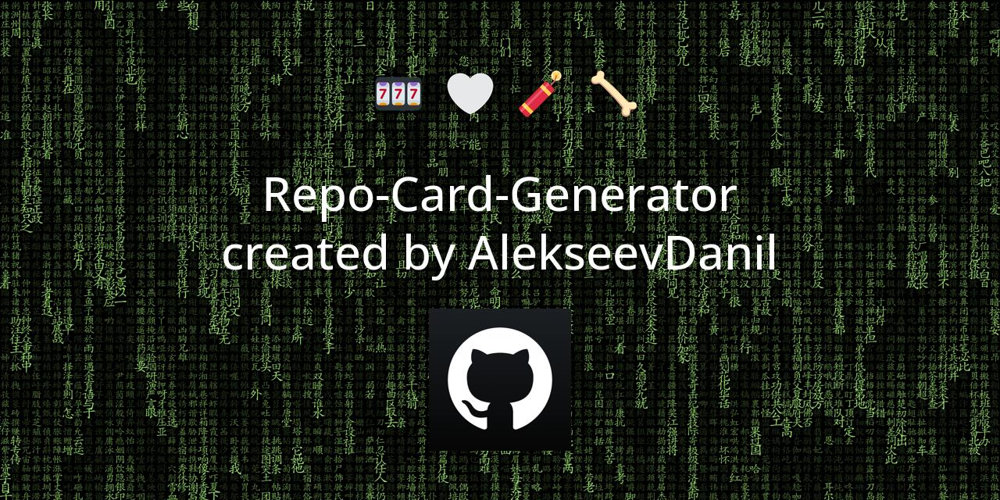

# Repository Card Generator 🌠



## Overview


**Repo Card** - this is the image that adorns your repository when shared by users. And I had a problem creating a repository map design. And since I'm a developer, not a designer, I decided to automate the creation of unique maps through code.
I think for many newbies to GitHub or people who, like me, do not want to spend time on this, it will be useful to create a cool (hopefully) one-line repository card via the terminal. You can see an example of such a card in the image above.

## Quick Start
For those who already want to generate a card as soon as possible\
Go to the file *config.yml*
```yml
image:
  shape:
    width: 1280
    height: 640
  save_path: "./repo_card.jpg"
  show: True


content:
  repository_name: "Your repository name"
  repository_author: "Your profile name"
```
Here we need to change 2 important parameters _repository_name_, _repository_author_ and 1 optional _save_path_ (full path to the directory where the card is saved)

After we go to the terminal directly from the project and write two command `pip3 install -r -U requirements.txt` and `python3 main.py "path to config.yml"`\
That's all! Our first automated repository card is ready 😊

## Mini Documentation
_There will not be a huge lecture here (maybe in the future), I will describe everything on the merits_

Let's run through the important files:
> **requirements.txt** - Required libraries for the code to work.\
> **config.yml** - Optional card configuration file.\
> **beautifulrepo/generator.py** - everything you need is here.\
> **main.py** - program start script.

Let's take a look at two of them.

### config.yml
This is a mandatory name for the file if we want to use it instead of parameters in the code
```yml
image: # all image options
  shape: # future image size
    width: 1280
    height: 640
  save_path: "./repo_card.jpg" # full path where to save the image
  show: True # True - to show the result of the program in a new window, False if not needed


content: # working with image content
  repository_name: "your repository name" # repository name
  repository_author: "your profile name" # repository author name
  font_path: "path to your font" # full path to your favorite font, by default OpenSans
  avatar_path: "path to file" # full path to your profile picture (be sure to make it square)
```
### beautifulrepo/generator.py

Tip: There are clear comments in the code that will help you better understand how the application works.

Here is the main **CardGenerator()** class.

Params:
- _config_filepath_ (optional, type: str) - path to configuration file. [!] Mandatory config.yml name.\
```python
from beautifulrepo.generator import CardGenerator

cg = CardGenerator(config_filepath="config.yml")
```
With it, we can **.create()** - create image card

Params:
- _shape_ (required if config.yml not exist, type: typle) - parameter indicating the size of the future image: (recommended: (1280, 640) )
- _repository_name_ (required if config.yml not exist, type: str) - the name of your repository
- _repository_author_ (required if config.yml not exist, type: str) - your name
- _font_path_ (optional, type: str) - path to font
- _avatar_path_ (optional, type: str) - path to the image (a square image is recommended, otherwise it will stretch into a square on its own)
- _background_path_ (optional, type: str) - path to background image
- _emoji_ (optional, type: str) - path to txt file with emoji inside (it is recommended to change the file itself, not the path)
```python
cg.create()
```
and **save()** - save card images.

Params:
- save_path (default value if config.yml exist: None) - path to save image. Type String. Be sure to include a filename
- show (default value: False) - parameter that allows you to display the image display window after saving
```python
cg.save()
```
## Contributing
Contributions are welcome. The program was created in VIM and may contain flaws. This is my little experiment of working exclusively in VIM. Make sure to follow [PEP 8](https://peps.python.org/pep-0008/) styling guidelines.

\
\
*🌟 If it helped you, you can star my repository. 🤩*
